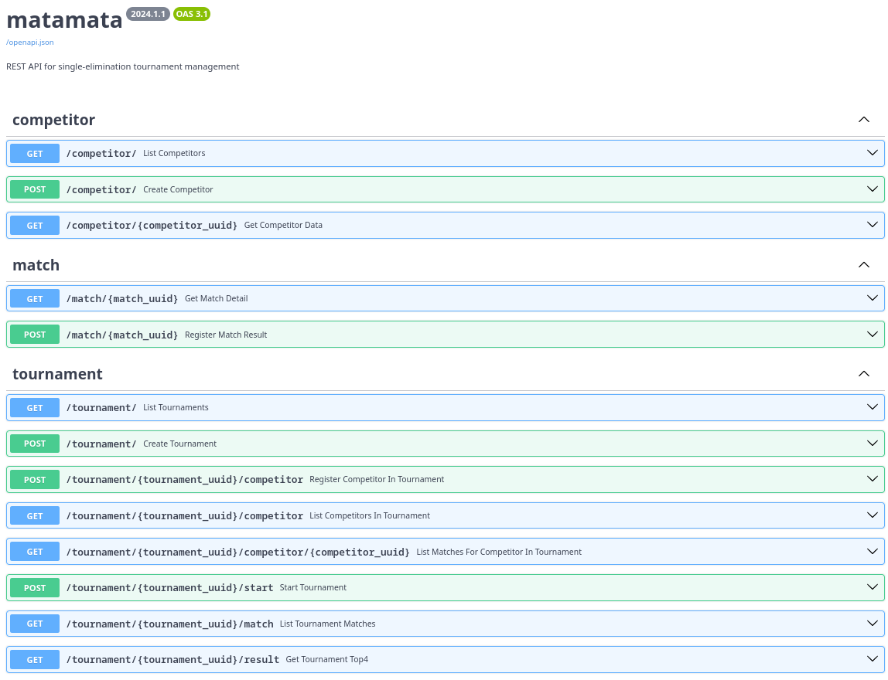

# **matamata** REST API for single-elimination tournament management

> Code repository author: [Alexandre Harano](mailto:email@ayharano.dev)

[*Mata-mata*](https://pt.wikipedia.org/wiki/Competi%C3%A7%C3%B5es_eliminat%C3%B3rias) is
a popular expression for [single-elimination tournament](https://en.wikipedia.org/wiki/Single-elimination_tournament)
in Brazil.

This project provides a simple REST API implementation of
single-elimination tournament management with features as
creating new tournaments, registering competitors,
retrieving the matches lists, win-lose management, and
other actions.

Documentation for this project are stored in [`docs`](./docs) directory
with a descriptive [`index.md file`](./docs/index.md).

[asciinema](https://asciinema.org/) demo from cloning to running the project:

[](https://asciinema.org/a/P1gYrv8EC4cBLZB1O5OhxOZEg)

While running the project, it is possible to access the interactive OpenAPI documentation.




# Project Configuration
This project uses [the twelve-factor app](https://12factor.net/) methodology.

Environment variables in this project can be stored using a `.env` (dot env) file.
For initial setup, a sample is provided as [`.env.sample`](.env.sample).
If you prefer to use a `.env` file, copy that sample as `.env` and modify the values accordingly.

A description of each of the variables is provided as the following list.

- `DATABASE_URL`: a string value to be used as an [Engine Configuration](https://docs.sqlalchemy.org/en/20/core/engines.html#database-urls) URL

# Project Installation
First, clone this repo:

```shell
$ git clone https://github.com/ayharano/matamata.git
```

After cloning the repository, change the directory to the project root.
All instructions below, including configuring the virtual environment and running the project, depend on being
in the project root directory.

## Python Version and Virtual Environment Setup
This project was tested by using CPython 3.12. In order to keep multiple versions of the Python interpreter, we recommend the use of pyenv.

- pyenv (Linux, macOS): [link](https://github.com/pyenv/pyenv)
- pyenv for Windows (Windows): [link](https://pyenv-win.github.io/pyenv-win/)

Once it is installed, we can use the same version as the one used during this project development, which was CPython 3.12.1.

Run the following:
```shell
$ pyenv install 3.12.1  # install CPython 3.12.1
$ pyenv local 3.12.1    # select CPython 3.12.1 as the local interpreter
```

As a directory name for the virtual env, for this tutorial we will use it as `virtualenvironment`.
If you prefer another name, just replace all the occurrences from here.

To install a virtual env, run the following:

```shell
$ python -m venv virtualenvironment
```

This way, a directory named `virtualenvironment` will be created at the project root to store the Python project dependencies.

## Using the local virtual env

Regarding the installation and the use of virtual envs, more details can be found at [the `venv` module documentation](https://docs.python.org/3/library/venv.html).

To use the virutal env, the instructions depend on the target operating system:

- venv for Linux or macOS

```shell
$ source virtualenvironment/bin/activate
```

- venv for Windows (PowerShell)

```powershell
virtualenvironment\Scripts\Activate.ps1
```

## Installing the project dependencies in the virtual env

Once the virtual env is activated, run:

```shell
python -m pip install --upgrade pip && python -m pip install --editable '.[test]' && python -m pip install --upgrade tzdata
```

This command is a chained call of 3 executions, being
1. upgrading the local `pip` to its most recent version
2. installing all the project dependencies, including the ones for testing, and installing the project as [an editable install](https://setuptools.pypa.io/en/latest/userguide/development_mode.html), and
3. enforce the most recent version of `tzdata`, which is used by Python to manage timezone data without relying on the data from the target operating system (more details at [the `zoneinfo` module documentation](https://docs.python.org/3/library/zoneinfo.html))

## Local `.env` file

As mentioned in [the `Project Configuration` section](#project-configuration), a sample `.env` file is provided as `.env.sample`.

Currently, it suggests using SQLite using a `local.db` file. If this configuration is maintained, whenever necessary, the file will be created or reused.

# Running the test suite

Once all the dependencies are installed, the following command can be issued to run the project test suite:

```shell
$ pytest --cov=src/matamata .
```

# Running the database migrations

Before running the application, we need to ensure that all the migrations ran.

Command:

```shell
$ alembic upgrade head
```

# Running the application

After all the previous setup was done, we can run the FastAPI `matamata` application.

```shell
$ uvicorn matamata.main:app --reload --env-file=.env
```

That command will run the [ASGI](https://asgi.readthedocs.io/) web server `uvicorn` with this project application.

By default, it will run on http://127.0.0.1:8000

To access the interactive OpenAPI documentation, just access http://127.0.0.1:8000/docs/

All the client access can be done in the URL that the server is running as the root of the system.

# Project Dependencies
- [Python](https://www.python.org/) 3.12+
- [uvicorn](https://www.uvicorn.org/) 0.25+
- [FastAPI](https://fastapi.tiangolo.com/) 0.108+
- [Pydantic Settings](https://docs.pydantic.dev/2.5/concepts/pydantic_settings/) 2.1

## Database Dependencies
- [SQLAlchemy](https://docs.sqlalchemy.org/en/20/) 2.0
- [SQLAlchemy-Utils](https://sqlalchemy-utils.readthedocs.io/) 0.41
- [Alembic](https://alembic.sqlalchemy.org/) 1.13

## Test Dependencies
- [pytest](https://docs.pytest.org/) 7.4
- [pytest-cov](https://pytest-cov.readthedocs.io/) 4.1
- [factory_boy](https://factoryboy.readthedocs.io/) 3.3
