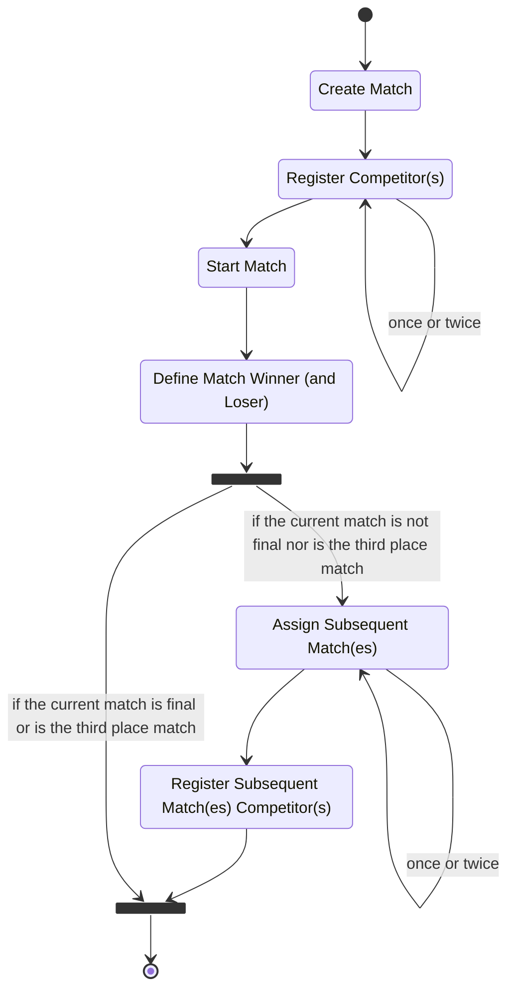
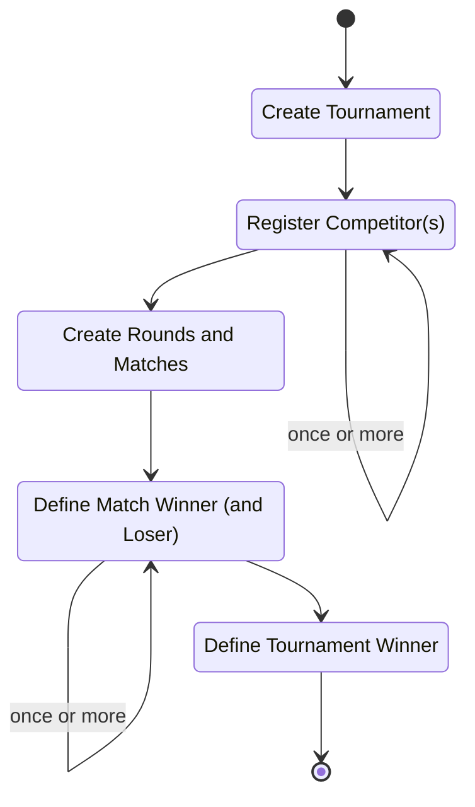

# 2. Defining Ubiquitous Language

Date: 2023-12-30

## Status

Proposed

## Context

Before we dive into the technical aspects of the solution, we need to establish a foundation that includes common terminology that will be used by all stakeholders involved.

The scope of the system is to manage [single-elimination tournaments](https://en.wikipedia.org/wiki/Single-elimination_tournament) exposing a REST API. For this document, we define expressions in the context of the solution for all stakeholders as well as the rules.

## Decision

### Expressions

The most important expressions for this system are *User*, *Competitor*, *Tournament*, and *Match*.

#### User
A client that interacts with the management system using REST API request-response cycles.

#### Competitor
A subject (individual, team, etc.) who competes in zero or more tournaments.

#### Tournament
Used ubiquitously as a representation of a [single-elimination tournament](https://en.wikipedia.org/wiki/Single-elimination_tournament).

#### Match
Confrontation between two competitors, with a result consisting of a winner and a loser. There may be cases where there is only one competitor and by default that competitor is the winner.

### Rules involving the defined expressions

- A competitor may compete in zero or more tournaments simultaneously.
- A tournament will be initially created without any registered competitors.
- A tournament must have at least one registered competitor for its matches to be created.
- A tournament is divided into one or more rounds with one or more matches.
- The system is responsible for the initial random generation of the rounds and matches following this set of rules.
- A match must be created with one competitor or two previous matches.
- A match will not have more than two competitors.
- The result of a match can only be defined if there is at least one competitor registered.
- A competitor will be defined as a winner or loser in the result of the match.
- The winning competitor will move on to the next round of the tournament unless the match is the final or third place.
- The winner of the tournament is the winner of the final match of the tournament.
- The matches before the final match are called semi-finals.
- If there are three or more competitors in a tournament, there will be a third place match: the losers of the semi-finals will compete for third place.
- A competitor who has been defined as the loser of a match will not be able to participate in the next round, except when they are the loser of a semi-final match.

### Caveats

While discussing tournaments, many concepts are generally applied.
This section lists items that we will not address in the context of the system.

- A competitor may NOT withdraw from a tournament. This specific rule implies that if two competitors in a match withdraw from the tournament, the system will require one of them to be chosen as the winner of the match.
- We will NOT record the score of a match, only the winner and loser.
- Continuing the previous item: this system will NOT allow a tie between two competitors in a match.

### Life Cycle Diagrams

#### Match Life Cycle

Based on the proposed rules, we have the following state machine representation of a match life cycle:

#### Tournament Life Cycle

Similarly to the matches life cycle, we have the following state machine representation of a tournament life cycle:

The items `Create Rounds and Matches`, `Define Match Winner (and Loser)`, and `Define Tournament Winner` are related to the previous [Match Life Cycle](#match-life-cycle) diagram.

## Consequences

Once a set of common expressions in the domain context is defined along with rules, we reduce the chances of misunderstanding during a conversation.
