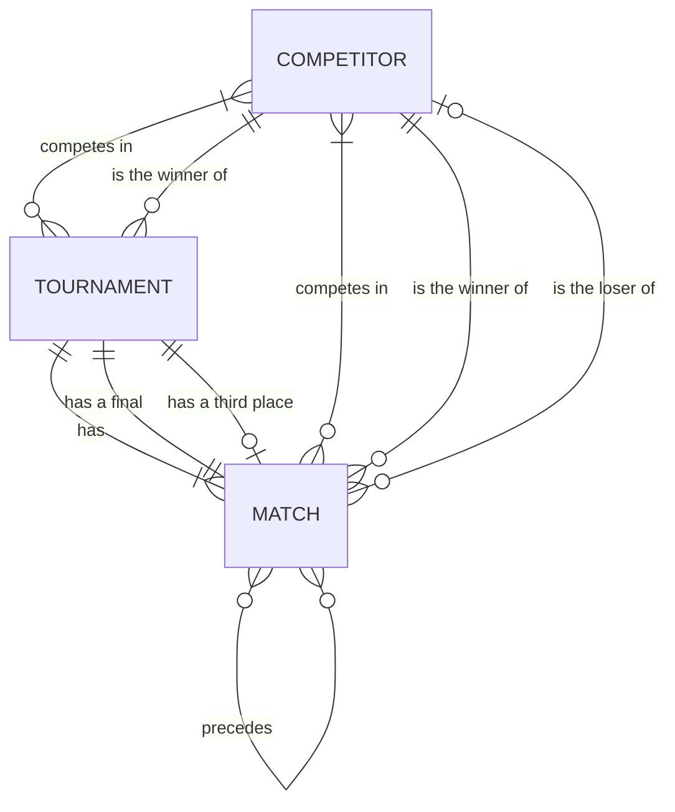
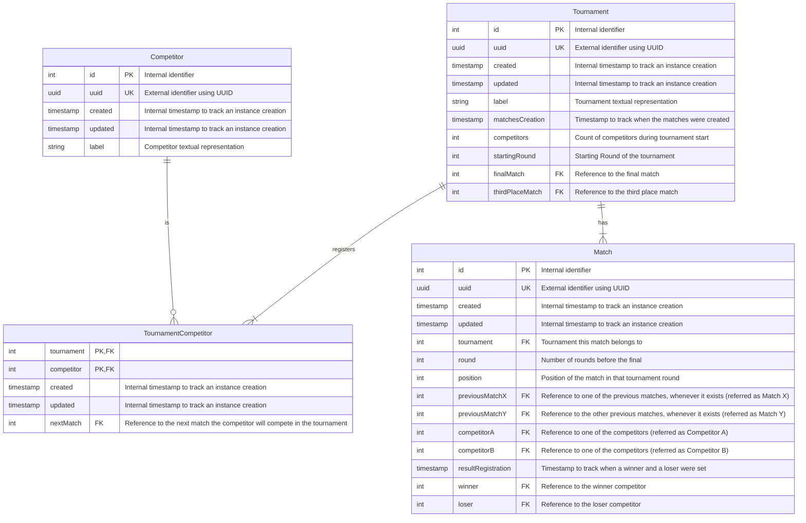
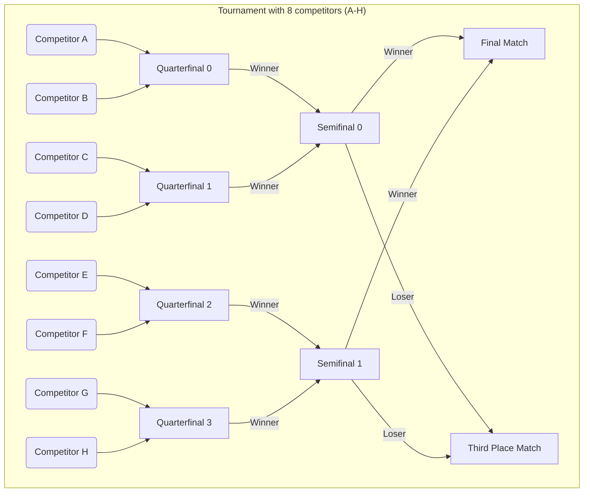
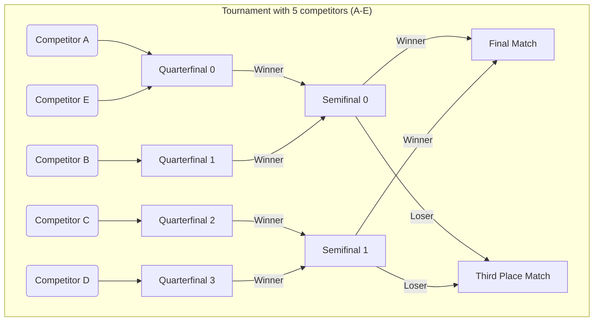

# 3. Data Modeling

Date: 2024-01-02

## Status

Proposed

Partially superceded by [5. Removing redundant data relationship](0005-removing-redundant-data-relationship.md)

Partially superceded by [8. Use of PostgreSQL and the Impact Over Previous Data Models](0008-use-of-postgresql-and-the-impact-over-previous-data-models.md)

## Context

After [the definition of ubiquitous language and the rules that the system will obey](0002-defining-ubiquitous-language.md),
this document contains a data modeling proposal to cover the interactions of
[Competitors](0002-defining-ubiquitous-language.md#competitor),
[Tournaments](0002-defining-ubiquitous-language.md#tournament), and
[Matches](0002-defining-ubiquitous-language.md#match).

## Decision

While the relationship between those expressions can be designed in many ways, for this document we decided to
abstract using entity-relationship diagram along a more concrete relational database models.

### Entity Relationship Diagram

Although it only has three entities, since there are many relationships between them, the diagram was visually crowded.

Here is a textual list of the same relationships:

- A competitor competes in zero or more tournaments, and a tournament has one or more competitor.
- A competitor is the winner of zero or more tournaments, and a tournament has one and only one winner.
- A tournament has one or more matches, and a match is part of one and only one tournament.
- A tournament has only one final match, and a match can be the final match only for one tournament.
- A tournament has zero or one third place match, and a match can be the third place match only for one tournament.
- A competitor competes in zero or more matches, and a match can be competed by one or more competitors (either one or two).
- A competitor is the winner of zero or more matches, and a match has one and only one winner.
- A competitor is the loser of zero or more matches, and a match has zero or one loser.
- A match precedes zero or more matches, and a match is preceded by zero or more matches (either zero or two).

### Relational Database Tables

While [the Entity Relationship Diagram](#entity-relationship-diagram) describes the many interactions of the entities,
from the perspective of maintaining balanced trade-offs of storage and operation of relational databases,
some of the mapped relationships can be calculated indirectly, for example: we don't need to store the winner of
a tournament if it can be calculated from the final match, unless it is very frequently accessed data.
This diagram also purposely omitted some details, such as the attributes of each entity.

The following diagram is another abstraction in which some of the relationships are absorbed as attributes.
Another relevant note is that due to the operation of the system a few attributes are added for convenience,
including the next match of a competitor in a tournament.

Each table has a name, and they are composed by four columns:
1. Data type
2. Attribute name
3. Attribute key
4. Attribute comment

For the attribute key values, here is a list of the acronyms:
- PK: primary key
- FK: foreign key
- UK: unique key

Similar to the first diagram, here is a textual list of the drawn relationships:

- A competitor competes in zero or more tournaments as a tournament competitor, and a tournament competitor is one and only one competitor.
- A tournament registers one or more tournament competitor, and a tournament competitor is registered in one and only one tournament.
- A tournament has one or more matches, and a match is part of one and only one tournament.

Note that those relationships were also represented as attributes respectively by
- `TournamentCompetitor.competitor`
- `TournamentCompetitor.tournament`
- `Match.tournament`

The other relationships were described as comments in the tables: just check the FK attributes.

Besides the relationship attributes, some explanation is required.

#### Identifiers

The single entity tables have two identifiers:
1. `id`: an integer to facilitate indexing of instances
2. `uuid`: a UUID field to expose the instance externally

That particular choice was taken to have indices in within the tables while avoiding potential attack vectors,
such as denial of service (DoS) based on exposed autoincrement primary keys.

[UUID](https://en.wikipedia.org/wiki/Universally_unique_identifier) is a 128-bit label which makes it harder to
guess the instances of a particular table.
[Most applications generate using the version 4 UUID](https://www.postgresql.org/docs/current/functions-uuid.html),
which is random,
[creating database performance problems when used as primary keys](https://buildkite.com/blog/goodbye-integers-hello-uuids).

Even if it wasn't mentioned before, Python is the language of choice for this project, and
[it still doesn't support UUIDv7](https://github.com/python/cpython/issues/89083#issuecomment-1763469938).

So for this proposal, we are using
[a mix of autoincrement integers as primary keys with external UUIDs](https://tomharrisonjr.com/uuid-or-guid-as-primary-keys-be-careful-7b2aa3dcb439).

#### Timestamps

The single entity tables also have two timestamp fields: `created` and `updated`.
While they themselves don't provide any value for tournament context, these timestamped values help with troubleshooting
whenever closer inspection is necessary.

Based on the same principle,
`Tournament.matchesCreation` timestamp value allows us to control whether the matches were already created or not, and
`Match.resultRegistration` timestamp value allows us to track when the winner and the loser of the match were set.

#### Label

The `label` fields for `Competitor` and `Tournament` are just textual placeholders to identify an instance.

#### Round and Position

Given that we are proposing data modeling in this document, a detail that wasn't mentioned yet was how to keep track of
which round a particular match belongs to. The fields `round` and `position` are intended to provide that information.

The combination of `Match.tournament`, `Match.round`, and `Match.position` should be unique in the database table.

Here is an example with 8 registered competitors:

A round edge node represents a competitor. In this diagram, we labeled them as letters from A to H.
A rectangular node represents a match.

As we are discussing how `round` and `position` are mapped into a *Match*, here is a mapping for this example:

- Quarterfinal 0: `round` 2 `position` 0
- Quarterfinal 1: `round` 2 `position` 1
- Quarterfinal 2: `round` 2 `position` 2
- Quarterfinal 3: `round` 2 `position` 3
- Semifinal 0: `round` 1 `position` 0
- Semifinal 1: `round` 1 `position` 1
- Final: `round` 0 `position` 0
- Third Place Match: `round` 0 `position` 1

In order to quickly identify where in a *Tournament* a *Match* belongs to, we represent a `position` as a zero-indexed value for each `round`.

Also, from the definition of [Match](0002-defining-ubiquitous-language.md#match),
we need at least one competitor or two previous matches, so whenever there is a number of participants that isn't a power of 2,
there will be some entry matches with only one competitor, who will be the winner by default.

In the previous and the next diagram the matches "Quarterfinal 0",  "Quarterfinal 1",  "Quarterfinal 2" and
"Quarterfinal 3" are the entry matches of the respective tournaments.

Here is a diagram of an example with five competitors ranging from A to E:

#### Previous Matches, Competitors, Winner and Loser

Regarding *Match* and *Competitor* references, there are some rules:

If it is an entry match, `previousMatchX` and `previousMatchY` will both be `null`, and at least `competitorA` will be set.

If it is an intermediate match with the result yet to be set, initially both `previousMatchX` and `previousMatchY` would be set,
and both `competitorA` and `competitorB` would be `null`.

The naming of the previous matches and the competitors doesn't form pairs (X/Y and A/B) for a reason:
normally, the winner of `previousMatchX` would be `participantA` and the winner of `previousMatchY` would be `participantB`.
However, that may not be the case for the third place match if the tournament has one.
So, to not mislead anyone dealing with this table, we purposely don't pair previous matches and competitors.

Regarding the *Tournament* table, two utility fields were added:
- *competitors*, to easily retrieve the number of competitors during the start of the tournament, and
- *startingRound*, to facilitate the iteration of the rounds.

#### `TournamentCompetitor` Many-to-many (M2M) table

`TournamentCompetitor` is a many-to-many table to relate `Tournament` with `Competitor` with the following operational attribute:

- `nextMatch`: by accessing the next match of a `Competitor` in a `Tournament`, we can validate if the competitor is still competing

## Consequences

Designing the data models to be used in the system before implementation allows us
to validate whether there are missing or hidden assumptions, giving us time
to re-evaluate a better solution in advance.
