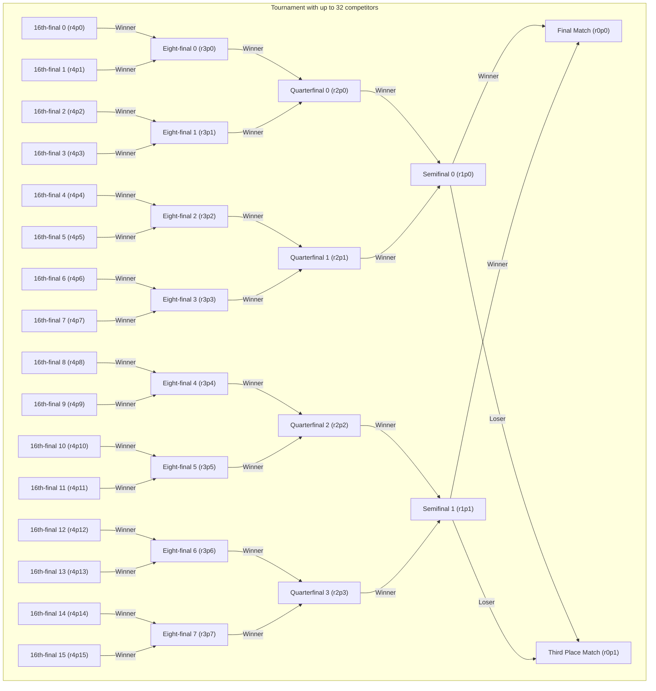
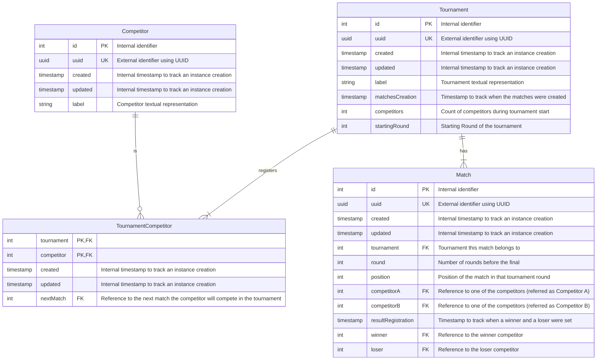

# 5. Removing Redundant Data Relationship

Date: 2024-01-04

## Status

Proposed

Partially supercedes [3. Data Modeling](0003-data-modeling.md)

Partially superceded by [8. Use of PostgreSQL and the Impact Over Previous Data Models](0008-use-of-postgresql-and-the-impact-over-previous-data-models.md)

## Context

During the implementation phase of the proposed data models, some issues arose.

In this document, we explain the reasoning of the previous decisions, point out what blocked us and propose alternatives.

## Decision

Some of the relationships we included in the database tables were included for convenience.
In this document, we focus on the relationships with *Match*es.

Between *Tournament* and *Match*, we had included two references: one to the final match and another to the third place match.

Between *Match* and itself, we included the reference to both the previous matches in case it isn't an entry match.

Those references were designed to make the navigation easier without relying on other properties.

However, as we also included the uniqueness of the group *Tournament*, *round*, and *position*, the use of references became redundant,
as we can make equivalent SQL queries.

### Issues with references

The tool of choice for the relational database mapping is [SQLAlchemy](https://www.sqlalchemy.org/).

As described earlier, there were multiple paths of joining tables for the *Tournament*/*Match* and *Match*/*Match* cases.

There is a documentation page explaining how [the handling of multiple join paths can be established](https://docs.sqlalchemy.org/en/20/orm/join_conditions.html),
but due to time constraints, we chose to use equivalent SQL operations to replace the references.

The trade-off was to weight the storage of the reference against the time cost of running queries with the same outcome.
As we faced the references issue described earlier, we will replace them with the SQL operations.

### Revisiting *Round* and *Position*

We had defined that *round* is a metric of how far the current *Match* is from the final match round and
*position* is the index of the *Match* within that particular round.
We will discuss how the round and position of a match is used to navigate between them.

An entry match is a match that doesn't depend on the results of previous matches.
One of the key concepts that we discussed in [the definition of a Match](0002-defining-ubiquitous-language.md#match)
is that it can only exist with at least one competitor.
Another definition that we left implicit in the previous diagrams is that a round must have a number of matches that is a power of two.

Here is a table associating the number of competitors with the number of the entry matches and
the starting round of a tournament, up to 64 competitors:

| Number of competitors | Number of entry matches | Tournament starting round |
|-----------------------|-------------------------|---------------------------|
| 1                     | 1                       | 0                         |
| 2                     | 1                       | 0                         |
| 3                     | 2                       | 1                         |
| 4                     | 2                       | 1                         |
| 5                     | 4                       | 2                         |
| ...                   | 4                       | 2                         |
| 8                     | 4                       | 2                         |
| 9                     | 8                       | 3                         |
| ...                   | 8                       | 3                         |
| 16                    | 8                       | 3                         |
| 17                    | 16                      | 4                         |
| ...                   | 16                      | 4                         |
| 32                    | 16                      | 4                         |
| 33                    | 32                      | 5                         |
| ...                   | 32                      | 5                         |
| 64                    | 32                      | 5                         |

Except for when there is only one competitor,
we can establish a rule between
the number of competitors (C),
the number of entry matches (M), and
the starting round of a tournament (R) as:

- $R = \lfloor\log_{2}{(C-1)}\rfloor$
- $M = 2^{R}$

(Rendering of the expressions rely on [LaTeX formatted math within Markdown](https://docs.github.com/en/get-started/writing-on-github/working-with-advanced-formatting/writing-mathematical-expressions))

Although we were discussed the entry matches, the relationship between
a round, not necessarily the starting one of the tournament, and
a number of matches within it is valid.
The number of matches within a round is important to establish the accepted values of *position* within a *round*.

Regarding the navigation of matches, we will extend the diagram from
[the Round and Position section of the system data modeling ADR](0003-data-modeling.md#round-and-position)
by textually listing the mapping of matches up to 64 competitors and
by visually displaying the mapping of matches up to 32 competitors.

- 32th-final 0: `round` 5 `position` 0
- 32th-final 1: `round` 5 `position` 1
- 32th-final 2: `round` 5 `position` 2
- 32th-final 3: `round` 5 `position` 3
- 32th-final 4: `round` 5 `position` 4
- 32th-final 5: `round` 5 `position` 5
- 32th-final 6: `round` 5 `position` 6
- 32th-final 7: `round` 5 `position` 7
- 32th-final 8: `round` 5 `position` 8
- 32th-final 9: `round` 5 `position` 9
- 32th-final 10: `round` 5 `position` 10
- 32th-final 11: `round` 5 `position` 11
- 32th-final 12: `round` 5 `position` 12
- 32th-final 13: `round` 5 `position` 13
- 32th-final 14: `round` 5 `position` 14
- 32th-final 15: `round` 5 `position` 15
- 32th-final 16: `round` 5 `position` 16
- 32th-final 17: `round` 5 `position` 17
- 32th-final 18: `round` 5 `position` 18
- 32th-final 19: `round` 5 `position` 19
- 32th-final 20: `round` 5 `position` 20
- 32th-final 21: `round` 5 `position` 21
- 32th-final 22: `round` 5 `position` 22
- 32th-final 23: `round` 5 `position` 23
- 32th-final 24: `round` 5 `position` 24
- 32th-final 25: `round` 5 `position` 25
- 32th-final 26: `round` 5 `position` 26
- 32th-final 27: `round` 5 `position` 27
- 32th-final 28: `round` 5 `position` 28
- 32th-final 29: `round` 5 `position` 29
- 32th-final 30: `round` 5 `position` 30
- 32th-final 31: `round` 5 `position` 31
- 16th-final 0: `round` 4 `position` 0
- 16th-final 1: `round` 4 `position` 1
- 16th-final 2: `round` 4 `position` 2
- 16th-final 3: `round` 4 `position` 3
- 16th-final 4: `round` 4 `position` 4
- 16th-final 5: `round` 4 `position` 5
- 16th-final 6: `round` 4 `position` 6
- 16th-final 7: `round` 4 `position` 7
- 16th-final 8: `round` 4 `position` 8
- 16th-final 9: `round` 4 `position` 9
- 16th-final 10: `round` 4 `position` 10
- 16th-final 11: `round` 4 `position` 11
- 16th-final 12: `round` 4 `position` 12
- 16th-final 13: `round` 4 `position` 13
- 16th-final 14: `round` 4 `position` 14
- 16th-final 15: `round` 4 `position` 15
- Eight-final 0: `round` 3 `position` 0
- Eight-final 1: `round` 3 `position` 1
- Eight-final 2: `round` 3 `position` 2
- Eight-final 3: `round` 3 `position` 3
- Eight-final 4: `round` 3 `position` 4
- Eight-final 5: `round` 3 `position` 5
- Eight-final 6: `round` 3 `position` 6
- Eight-final 7: `round` 3 `position` 7
- Quarterfinal 0: `round` 2 `position` 0
- Quarterfinal 1: `round` 2 `position` 1
- Quarterfinal 2: `round` 2 `position` 2
- Quarterfinal 3: `round` 2 `position` 3
- Semifinal 0: `round` 1 `position` 0
- Semifinal 1: `round` 1 `position` 1
- Final: `round` 0 `position` 0
- Third Place Match: `round` 0 `position` 1

In order to quickly identify where in a *Tournament* a *Match* belongs to, we represent a `position` as a zero-indexed value for each `round`.

### Data Retrieval Equivalence Chart

Based on the previous section information, we can list the equivalent references based on *round* and *position* as:

#### *Tournament* and *Match*

A final match can be retrieved as the match of the tournament with *round* 0 and position 0,
while the third place match can be retrieved as the match of the tournament with *round* 0 and position 1.

#### *Match* and *Match*

Regarding previous matches and next match, they can be retrieved using the following expressions:

The next match round is the current match round less one and the next match position is the integer division of the current position by 2.

Example:

16th-final 13 (r4p13) next match: Eight-final 6 (r3p6).
- round 4-1 -> round 3
- position 13 // 2 -> position 6

Similarly, the previous matches are the current match round plus one and the positions are the current position times 2 and that value plus one.

Example:

Quarterfinal 2 (r2p2) previous matches: Eight-final 4 (r3p4) and Eight-final 5 (r3p5).
- round 2+1 -> round 3
- position 2 * 2 -> position 4 and 5

Quarterfinal 2 `competitorA` is the winner from Eight-final 4 and `competitorB` is the winner from Eight-final 5.

The only exception to the described rules is the third place match (round 0 position 1), where the competitors are the losers from the semifinals (round 1).

### Updated Relational Database Tables

Based on what we discussed in this document so far, here is an updated version of
[the Relational Database Tables section of the system data modeling ADR](0003-data-modeling.md#relational-database-tables).

The changes were:

- Removal of `Tournament.finalMatch`
- Removal of `Tournament.thirdPlaceMatch`
- Removal of `Match.previousMatchX`
- Removal of `Match.previousMatchY`

This way, we reduce the number of multiple join paths involving the *Match* table
by replacing the equivalent relationships with SQL queries based on
the appropriate values of *tournament_id*, *round*, and *position*.

## Consequences

By adopting the proposed changes, we will make the data modeling simpler,
meaning it would be more straightforward to implement and maintain the features in the system.
