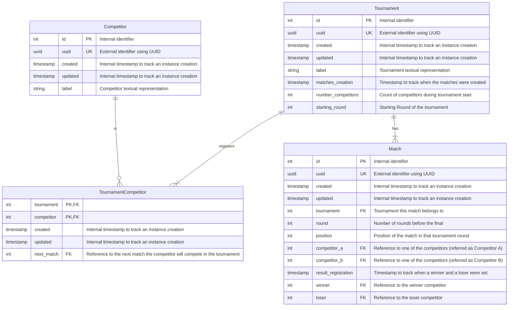

# 8. Use of PostgreSQL and the Impact Over Previous Data Models

Date: 2024-01-10

## Status

Proposed

Partially supercedes [3. Data Modeling](0003-data-modeling.md)

Partially supercedes [5. Removing Redundant Data Relationship](0005-removing-redundant-data-relationship.md)

## Context

Although it wasn't described previously as an ADR,
we have been using [SQLite](https://www.sqlite.org/) as the
[Relational Database Management System (RDBMS)](https://en.wikipedia.org/wiki/Relational_database)
of the *matamata* REST API endpoints system.

To prepare the system to be more scalable,
we are replacing SQLite with
[PostgreSQL](https://www.postgresql.org/),
which is also widely used in the market.

We aren't providing the rationale of the reasons
for the replacement in this document, just a report
of the issues that appeared.

This document also incorporate the changes and provide an updated version of
a Relational Database Diagram based on
the ones from ADR
[3. Data Modeling](0003-data-modeling.md#relational-database-tables)
and
[5. Removing Redundant Data Relationship](0005-removing-redundant-data-relationship.md#updated-relational-database-tables).

## Decision

### Issues regarding changing from SQLite to PostgreSQL

After facing the following issues, we are
[regenerating the migration script](https://alembic.sqlalchemy.org/en/latest/tutorial.html#create-a-migration-script)
to accommodate the changes to replace SQLite to [PostgreSQL](https://www.postgresql.org/).

#### Constraint Name Length Limit

When we were
[running the existing migration file](https://alembic.sqlalchemy.org/en/latest/tutorial.html#running-our-first-migration),
the first issue was related to the length of the name of one of the
[CHECK constraints](https://docs.sqlalchemy.org/en/20/core/constraints.html#check-constraint)
being longer than 63 characters.

We didn't encounter that kind of issue while using [Alembic](https://alembic.sqlalchemy.org/) with SQLite,
but it seems to be a restriction when using
[psycopg](https://www.psycopg.org/).

The original constraint name was
`tournament_matchesCreation_competitors_startingRound_must_be_all_null_or_all_set_under_conditions`,
with 97 characters.

It was replaced with a more concise version as
`tournament_all_null_or_all_set_under_conditions`
with 47 characters.

#### [Camel Case](https://en.wikipedia.org/wiki/Camel_case) Fields

After fixing the constraint name, other issues related to CHECK constraints appeared:
somehow there was an issue related to psycopg or
PostgreSQL normalizing the field names to lowercase.
That change impacted in a manner that we weren't able to keep using
[camel case](https://en.wikipedia.org/wiki/Camel_case) fields.

The adopted solution was to replace all the tables with camel case fields with
[snake case](https://en.wikipedia.org/wiki/Snake_case).

For the external fields defined in
[Pydantic](https://docs.pydantic.dev/)
models/schemas, we didn't need to remap because
we could use
[*validation aliases*](https://docs.pydantic.dev/latest/concepts/fields/#field-aliases)
to map from the
[SQLAlchemy](https://docs.sqlalchemy.org/en/20/)
models to the Pydantic ones.

### Yet Another Updated Relational Database Tables

Based on what we discussed in this document so far, here is an updated version of
[the Relational Database Tables section of the system data modeling ADR](0005-removing-redundant-data-relationship.md#updated-relational-database-tables).

Here is a table of the previous and the new field names:

| Previous field name              | New field name                    |
|----------------------------------|-----------------------------------|
| `Match.competitorA`              | `Match.competitor_a`              |
| `Match.competitorB`              | `Match.competitor_b`              |
| `Match.resultRegistration`       | `Match.result_registration`       |
| `Tournament.matchesCreation`     | `Tournament.matches_creation`     |
| `Tournament.competitors`         | `Tournament.number_competitors`   |
| `Tournament.startingRound`       | `Tournament.starting_round`       |
| `TournamentCompetitor.nextMatch` | `TournamentCompetitor.next_match` |

One undocumented change from
[5. Removing Redundant Data Relationship](0005-removing-redundant-data-relationship.md)
was that instead of `Tournament.competitors`,
we were using internally
`Tournament.numberCompetitors`
because of a conflict related to using
[`Tournament.competitors`](https://github.com/ayharano/matamata/blob/ea95f197e63c57903a8b821925a75de2321033eb/src/matamata/models/tournament.py#L46-L49)
as a collection of `Competitor`s.

During the conflicts, `TournamentCompetitor` wasn't affected
because it was
[already implemented with snake case since the beginning](https://github.com/ayharano/matamata/blob/0533c56749a75023f95eecb51ecc0ccef3f459c2/src/matamata/models/tournament_competitor.py#L16-L20).

## Consequences

With the proposed changes, we will resume the change of the RDBMS from SQLite to PostgreSQL.
